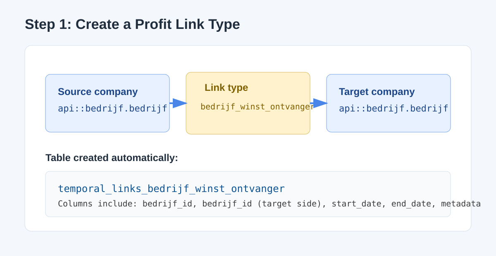
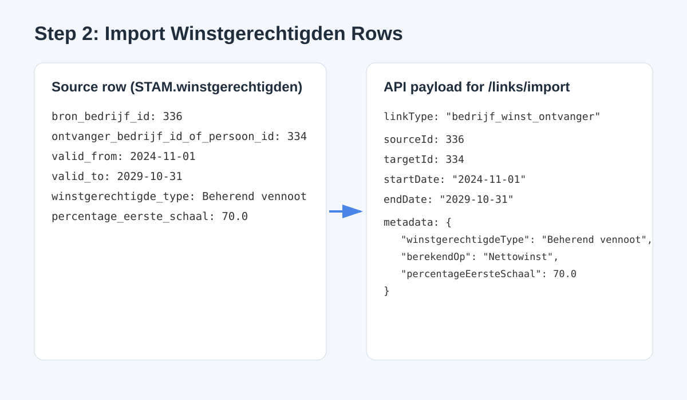

# Profit Receiver Links (Company -> Company)

This README explains how to create a new temporal link type for profit receivers, import data from `STAM.winstgerechtigden`, and query the result in both directions.

The guide is focused on this use case:

- source company gives profit
- target company receives profit

## 1. Prerequisites

1. Start Strapi:

```powershell
.\develop.cmd
```

2. Ensure the temporal plugin API is reachable:

```powershell
Invoke-WebRequest -UseBasicParsing "http://localhost:1337/api/temporal-relations/link-types" | Select-Object -ExpandProperty Content
```

## 2. Create a New Link Type

Use a dedicated link type for company-to-company profit links.

Recommended name:

- `bedrijf_winst_ontvangen`

Example request:

```json
POST /api/temporal-relations/link-types
{
  "name": "bedrijf_winst_ontvangen",
  "sourceUid": "api::bedrijf.bedrijf",
  "targetUid": "api::bedrijf.bedrijf"
}
```

Visual:



Notes:

- The plugin creates a dedicated physical table automatically.
- Table name pattern: `temporal_links_<linkTypeName>`.
- For this example: `temporal_links_bedrijf_winst_ontvangen`.
- For this profit type, physical source/target columns are:
  - `bron_bedrijf_id`
  - `ontvanger_bedrijf_id_of_persoon_id`
- Extra typed columns are also stored physically:
  - `berekend_op`
  - `percentage_eerste_schaal`
  - `bedrag_eerste_schaal`
  - `restant_percentage`
  - `winstgerechtigde_type`

## 3. Map STAM.winstgerechtigden to Link Payload

Given your source format:

```sql
INSERT INTO STAM.winstgerechtigden
(winstgerechtigden_id, bron_bedrijf_id, ontvanger_bedrijf_id_of_persoon_id, berekend_op, percentage_eerste_schaal, bedrag_eerste_schaal, restant_percentage, winstgerechtigde_type, valid_from, valid_to)
VALUES
(24, 336, 334, 'Nettowinst', 70.0000000, NULL, NULL, 'Beherend vennoot', CONVERT(DATE, '2024-11-01', 120), CONVERT(DATE, '2029-10-31', 120));
```

Use this mapping:

- `bron_bedrijf_id` -> `sourceId`
- `ontvanger_bedrijf_id_of_persoon_id` -> `targetId` (company-only flow in this README)
- `valid_from` -> `startDate`
- `valid_to` -> `endDate`
- descriptive fields -> `metadata`

Example import request:

```json
POST /api/temporal-relations/links/import
{
  "linkType": "bedrijf_winst_ontvangen",
  "links": [
    {
      "sourceId": 336,
      "targetId": 334,
      "startDate": "2024-11-01",
      "endDate": "2029-10-31",
      "metadata": {
        "winstgerechtigdenId": 24,
        "berekendOp": "Nettowinst",
        "percentageEersteSchaal": 70.0,
        "bedragEersteSchaal": null,
        "restantPercentage": null,
        "winstgerechtigdeType": "Beherend vennoot"
      }
    }
  ]
}
```

Visual:



## 4. Does the reverse side show automatically?

Yes.

A single inserted link is queryable in both directions automatically:

1. From giver to receiver (`source` -> `target`)
2. From receiver to giver (`target` -> `source`)

You do not need to insert a second mirrored row for read/query behavior.

## 5. Split by "gives" and "receives"

Yes, this is supported.

Use separate endpoints:

1. Gives profit (outgoing from company)

```text
GET /api/temporal-relations/links/source-history?linkType=bedrijf_winst_ontvangen&sourceId=<bedrijf_id>
```

2. Receives profit (incoming to company)

```text
GET /api/temporal-relations/links/target-history?linkType=bedrijf_winst_ontvangen&targetId=<bedrijf_id>
```

Visual:


## 6. Example checks in PowerShell

1. Link type exists:

```powershell
Invoke-WebRequest -UseBasicParsing "http://localhost:1337/api/temporal-relations/link-types" | Select-Object -ExpandProperty Content
```

2. Outgoing links for company 336:

```powershell
Invoke-WebRequest -UseBasicParsing "http://localhost:1337/api/temporal-relations/links/source-history?linkType=bedrijf_winst_ontvangen&sourceId=336" | Select-Object -ExpandProperty Content
```

3. Incoming links for company 334:

```powershell
Invoke-WebRequest -UseBasicParsing "http://localhost:1337/api/temporal-relations/links/target-history?linkType=bedrijf_winst_ontvangen&targetId=334" | Select-Object -ExpandProperty Content
```

## 7. Handling mixed company/person receiver field

Your source field `ontvanger_bedrijf_id_of_persoon_id` may contain person values too (for example negative ids in your sample).

Recommended approach:

1. Company receivers: import into `bedrijf_winst_ontvangen` (this README flow).
2. Person receivers: import into a separate link type, for example `bedrijf_winst_ontvangen_persoon` with:
- `sourceUid = api::bedrijf.bedrijf`
- `targetUid = api::persoon.persoon`

This keeps query semantics clean and avoids overloading one table with mixed entity domains.

## 8. Legacy migration note

If legacy table `temporal_links` exists, bootstrap backfills data into table-backed link types.

To inspect:

```powershell
.\.tools\node\node.exe .\_check_db.js
```

## 9. Quick summary

1. Create `bedrijf_winst_ontvangen` once.
2. Import rows using `sourceId` (giver) and `targetId` (receiver).
3. Query gives via `source-history` and receives via `target-history`.
4. Reverse visibility is automatic.

## 10. Do the same in Strapi GUI

This plugin has a dedicated admin page where you can do the full flow without manual API calls.

Open:

- Strapi Admin -> Temporal Relations

If you do not see "Temporal Relations" in the left menu:

1. Open it directly in the browser:

```text
http://localhost:1337/admin/plugins/temporal-relations
```

2. Hard-refresh the admin page (`Ctrl+F5`).
3. Make sure you started with `develop.cmd` (not an old cached admin build).
4. Restart Strapi after plugin changes.

Current project check: both routes return `200`:

- `/api/temporal-relations/link-types`
- `/admin/plugins/temporal-relations`

Inside that page, use two tabs:

- Relation Types
- Links

### 10.1 Create the relation type in GUI

1. Open the Relation Types tab.
2. In New relation type, fill:
- Machine name: `bedrijf_winst_ontvangen`
- Source UID: `api::bedrijf.bedrijf`
- Target UID: `api::bedrijf.bedrijf`
- Optional labels and description.
3. Click Create.

Result:

- The relation type appears in the list.
- The physical table is created automatically.

### 10.2 Add a single link in GUI

1. Open the Links tab.
2. Click + Create link.
3. Fill:
- Relation type: `bedrijf_winst_ontvangen`
- Source ID: value from `bron_bedrijf_id`
- Target ID: value from `ontvanger_bedrijf_id_of_persoon_id` when it is a company id
- Start date: `valid_from`
- End date: `valid_to`
- Typed fields (no raw JSON needed):
  - `berekendOp` (select)
  - `winstgerechtigdeType` (select)
  - `percentageEersteSchaal`
  - `bedragEersteSchaal`
  - `restantPercentage`
  - `winstgerechtigdenId`

Allowed select values:

- `berekendOp`: `Brutowinst`, `Nettowinst`, `Restant winst`
- `winstgerechtigdeType`: `Aandeelhouder`, `Beherend vennoot`, `Commanditair vennoot`

4. Click Create.

### 10.3 Bulk import in GUI

1. In Links, click Bulk import.
2. Choose relation type: `bedrijf_winst_ontvangen`.
3. Paste tab-separated rows in this format:

```text
sourceId<TAB>targetId<TAB>startDate<TAB>endDate<TAB>metadataJson
```

Example row:

```text
336	334	2024-11-01	2029-10-31	{"winstgerechtigdenId":24,"berekendOp":"Nettowinst","percentageEersteSchaal":70.0,"winstgerechtigdeType":"Beherend vennoot"}
```

4. Click Import.

Validation note:

- API and import now enforce the same allowed select values server-side.
- Invalid `berekendOp` or `winstgerechtigdeType` values are rejected with `400`.

### 10.4 Split in GUI: Gives vs Receives

Use the Query sub-tab in Links and run separate searches:

1. Gives (outgoing):
- Direction: Source full history
- Entity ID: source company id

2. Receives (incoming):
- Direction: Target full history
- Entity ID: receiver company id

This gives you the split view from one table-backed link type.

### 10.5 Does reverse visibility appear automatically in GUI?

Yes.

After creating one link row, it is visible in both directions when you switch direction in Query:

- Source views show what the company gives.
- Target views show what the company receives.

No duplicate mirrored row is required.

### 10.6 Automatic panel on Bedrijf edit page

Yes. Link types are shown automatically on Bedrijf whenever Bedrijf is part of that link type.

Where:

1. Open Content Manager.
2. Open a Bedrijf item.
3. In the right side panels, look for:
- Relaties (tijdgebonden)

What it shows:

1. Per link type where Bedrijf is involved, it shows the relevant direction(s):
- Bedrijf -> Groep: outgoing section to groepen
- Persoon -> Bedrijf: incoming section from personen
- Bedrijf -> Bedrijf: both outgoing and incoming
2. For types where Bedrijf is source, you can add outgoing links directly from that panel.

This means existing and new link tables should appear automatically on Bedrijf records without extra panel code per type.

### 10.7 Link actions in GUI

For each dynamic link row in the Bedrijf panel, you can now:

1. Open item: jump to the linked content item in Content Manager.
2. Bewerk: edit dates and typed extra fields.
3. Verwijder: delete link row.

### 10.8 Compact add controls

Add forms are collapsed by default.

Use `+ Toevoegen` to open, and `Annuleer` to collapse again.

This keeps the panel compact when you are not editing.

### 10.9 Reorder dynamic entries

Each dynamic link type block has `↑` and `↓` buttons.

Use those to reorder visual blocks in the Bedrijf panel. The order is stored in browser local storage and reused on refresh.

### 10.10 Typed extra fields (no raw JSON input)

Dynamic forms now render typed fields per link type profile.

1. Profit-style links (`winst` in link type name):
- berekendOp (select: Brutowinst, Nettowinst, Restant winst)
- winstgerechtigdeType (select: Aandeelhouder, Beherend vennoot, Commanditair vennoot)
- percentageEersteSchaal
- bedragEersteSchaal
- restantPercentage
- winstgerechtigdenId

2. `koppeling_persoon_bedrijf` links:
- tekenbevoegd (boolean)

These are stored in metadata internally, but in the GUI you work with normal typed form fields instead of JSON text.

## 11. Important note for mixed receiver ids

If `ontvanger_bedrijf_id_of_persoon_id` can represent both company and person ids, do not mix those domains in one company-to-company relation type.

Recommended split:

1. `bedrijf_winst_ontvangen` for company receivers.
2. `bedrijf_winst_ontvangen_persoon` for person receivers.

This keeps GUI filters and query semantics clear.
